<script type="text/javascript" src="http://cdn.mathjax.org/mathjax/latest/MathJax.js?config=TeX-AMS-MML_HTMLorMML"></script>
<script type="text/x-mathjax-config">
    MathJax.Hub.Config({ tex2jax: {inlineMath: [['$', '$']]}, messageStyle: "none" });
</script>

# 上机实验报告：基于弗雷瑟图的等距插值程序实现


## 一、实验目标
1. 通过编程实现“等距节点有限差分插值”的完整流程：输入节点数据 → 构建差分表 → 计算插值结果。
2. 使用 **弗雷瑟图（Fraser Diagram）** 将差分表可视化，使差分结构更直观。
3. 在统一框架下实现并对比 6 种经典等距插值方法（牛顿前/后插、高斯前/后向、斯特林插值、贝塞尔插值），并给出稳定性分析。
4. 提供交互式可解释性：点击不同方法即可在图上高亮对应“取差分系数的路径”。

> **📦 项目交付物说明**
> 本实验已将完整源代码托管至 GitHub，并发布了可直接运行的 `.exe` 程序。
> - **GitHub 仓库**：`https://github.com/An0hana/fraser-diagram`
> - **可执行程序**：可在仓库 `Releases` 页面下载 `FraserDiagram.exe` (无需 Python 环境即可运行)。

## 二、实验内容
本实验实现的功能包括：
1. **输入解析与校验**
   - 从 GUI 输入框读取 `X NODES`、`Y VALUES`、`TARGET X` 以及 `TRUE FUNC`；
   - 支持中英文逗号输入；
   - 检查 X 与 Y 数量一致（不一致报错 `Mismatch Len`）；
   - 检查 X 是否等距（非等距报错 `Not Equal Dist`）。
2. **差分表构建**
   - 构建 `diff_table[i][j]`，其中 `j` 为差分阶数、`i` 为行号；
   - 递推：`diff_table[i][j] = diff_table[i+1][j-1] - diff_table[i][j-1]`；
   - 时间复杂度约为 `O(n^2)`。
3. **弗雷瑟图绘制**
   - 将差分表按菱形拓扑绘制，每个节点显示对应差分值；
   - 用连线表示差分递推关系；
   - 自动标出本次插值的“基准节点” `BASE k`。
4. **六种插值结果计算与对比**
   - Newton F、Newton B、Gauss F、Gauss B、Stirling、Bessel；
   - 输出到 Ledger；并额外输出 `AVERAGE`（6 种方法的均值）。
5. **稳定性检查**
   - 取 6 方法结果的极差 `rng = max(values) - min(values)`；
   - 稳定性判断依据：
     - `rng < 1e-5`：High Precision
     - `rng < 0.1`：Minor Fluctuations
     - 否则：Unstable Results
6. **交互式路径高亮**
   - 点击 Ledger 对应方法行，在弗雷瑟图表上高亮路径：
     - Stirling：叠加两条 Gauss 路径
     - Bessel：出现“分叉/均值”式连接
7. **插值曲线绘制与对比**
   - 在独立窗口中绘制插值多项式 $P(x)$ 的连续曲线（基于 200 个采样点）；
   - 支持输入真实函数表达式 $f(x)$（如 `np.sin(x)`），并在同一坐标系下对比 $P(x)$ 与 $f(x)$ 的差异；
   - 动态更新：点击 Ledger 不同方法时，曲线颜色与形态随之更新。

## 三、实现过程

### 3.1 程序整体流程
1. 启动程序：`python main.py`，创建 Tk 主窗口并实例化 `InterpolationApp`。
2. 输入 `X NODES / Y VALUES / TARGET X`，点击 `CRAFT!`。
3. `process_data()` 执行：
   1) 清空旧图与旧表格、清空日志；  
   2) 调用 `calculator.load_data()` 完成解析与等距检查；  
   3) 构建差分表 `_build_diff_table()`；  
   4) 调用 `plotter.plot_diagram()` 绘制 Fraser 图，并标注 `BASE k`；  
   5) 调用 `calculate_all()` 得到 6 方法结果；写入 Ledger；计算 AVERAGE；  
   6) 在 Log 输出：步长 `h`、基准节点 `x0`、位置参数 `p`、稳定性判据与交互提示；  
4. 用户点击 Ledger 某一行触发 `on_tree_select()`，调用 `plotter.highlight_path()` 高亮对应路径。

### 3.2 等距检查与关键参数
- 等距检查：令 `diff = np.diff(X)`，若 `not np.allclose(diff, diff[0])` 则报错 `Not Equal Dist`。  
- 步长：`h = diff[0]`  
- 基准节点选择（你的实现）：  
  `base_k = argmin |X - target_x|`（选择离目标点最近的节点）
- 位置参数：  
  `p = (target_x - X[base_k]) / h`  
  并在 Log 中输出位置描述 Center/Left/Right。

### 3.3 差分表递推（核心共享模块）
差分表是所有插值方法的基础。程序使用二维数组 `diff_table` 存储，通过双重循环实现 $O(n^2)$ 的递推计算。

```python
# 构建差分表
def _build_diff_table(self):
    # 初始化 n*n 矩阵
    self.diff_table = np.zeros((self.n, self.n))
    # 第 0 列存储原始 Y 值
    self.diff_table[:, 0] = self.Y
    
    # 递推计算：后一列 = 前一列下行 - 前一列本行
    for j in range(1, self.n):
        for i in range(self.n - j):
            self.diff_table[i][j] = (self.diff_table[i+1][j-1] 
                                     - self.diff_table[i][j-1])
```

差分表将 6 种插值方法优美地统一在同一框架之内，不同方法仅在于选取差分系数的路径不同。

### 3.4 Fraser 图坐标映射
绘制时采用如下映射（与你 plotter 一致）：
- 列坐标：`x = j`
- 行坐标：`y = -(i + j/2)`
这样每一阶差分相对前一阶会在纵向“错半格”，视觉上形成菱形层级结构。

### 3.5 路径高亮规则
- Newton F：在同一行逐列向右（固定 row=k）
- Newton B：每前进一阶，row 向上移动（row=k-j）
- Gauss F / Gauss B：按奇偶阶交错移动 row
- Stirling：叠加 Gauss F 与 Gauss B 两条路径
- Bessel：奇数阶显示“从两点合成一点”的分叉连线；偶数阶显示由中间点向上下两点扩散（反映均值结构）

### 3.6 核心插值算法实现
程序通过 `calculate_all` 方法一次性计算所有结果。以下分模块展示六种方法的实现逻辑，清晰体现了它们在系数选取上的差异。

**1. 牛顿前插 (Newton Forward)**
路径特征：从基准点 $(k,0)$ 水平向右，利用下方数据。
```python
val = sum(self.binom(p, j) * self.get_diff(k, j) 
          for j in range(n) if k <= n-1-j)
results['Newton F'] = val
```

**2. 牛顿后插 (Newton Backward)**
路径特征：从基准点 $(k,0)$ 沿对角线向上，利用上方数据。
```python
val = sum(self.binom(p + j - 1, j) * self.get_diff(k - j, j) 
          for j in range(n) if k - j >= 0)
results['Newton B'] = val
```

**3. 高斯前插 (Gauss Forward)**
路径特征：奇数阶下移，偶数阶水平（锯齿状向下）。
```python
val = 0
for j in range(n):
    row = k - (j // 2)
    m = j // 2
    # 偶数项系数 binom(p+m-1, j)，奇数项系数 binom(p+m, j)
    coef = (self.binom(p + m - 1, j) if (j > 0 and j % 2 == 0) 
            else self.binom(p + m, j))
    val += coef * self.get_diff(row, j)
results['Gauss F'] = val
```

**4. 高斯后插 (Gauss Backward)**
路径特征：奇数阶上移，偶数阶水平（锯齿状向上）。
```python
val = 0
for j in range(n):
    row = k - ((j + 1) // 2)
    m = j // 2
    coef = self.binom(p + m, j)
    val += coef * self.get_diff(row, j)
results['Gauss B'] = val
```

**5. 斯特林 (Stirling)**
定义：高斯前插与高斯后插的算术平均，体现中心对称性。
```python
results['Stirling'] = (results['Gauss F'] + results['Gauss B']) / 2
```

**6. 贝塞尔 (Bessel)**
定义：基于半点 $p-0.5$ 的插值，偶数阶取均值。
```python
val_bessel = 0
for m in range(n // 2 + 1):
    # 偶数阶项 (2m)
    j2 = 2 * m
    if j2 < n:
        coef = 1 if m == 0 else self.binom(p + m - 1, j2)
        mean_diff = (self.get_diff(k-m, j2) 
                     + self.get_diff(k-m+1, j2))/2
        val_bessel += coef * mean_diff
    # 奇数阶项 (2m+1)
    j3 = 2 * m + 1
    if j3 < n:
        coef = ((1 if m == 0 else self.binom(p + m - 1, 2*m)) 
                * (p-0.5)/(2*m+1))
        val_bessel += coef * self.get_diff(k-m, j3)
results['Bessel'] = val_bessel
```

### 3.7 插值曲线可视化模块
为了直观评估插值效果，实现了 `CurvePlotter` 类。
- **采样策略**：使用 `np.linspace` 在 $[x_{min}, x_{max}]$ 范围内生成 200 个密集采样点。
- **多项式求值**：对每个采样点调用 `calculator.calculate_method_value()` 计算插值结果。
- **真值对比**：支持解析用户输入的数学表达式（如 `x**2 + 1`），利用 Python 的 `eval` 函数计算真值曲线，与插值曲线叠加显示，从而直观观察截断误差。

## 四、实验数据设计（输入）
为了全面验证程序功能及算法特性，本实验设计了三组测试用例，分别用于展示常规流程、验证边界效应以及验证理论等价性。

### 4.1 案例 A：标准测试（正弦函数拟合）
> 说明：本案例用于生成第五章的主要截图。
- **X NODES**：`0, 1, 2, 3, 4, 5`
- **Y VALUES**：`0.0000, 0.8415, 0.9093, 0.1411, -0.7568, -0.9589` (取自 $y=\sin(x)$)
- **TARGET X**：`2.5`
- **TRUE FUNC**：`np.sin(x)`

### 4.2 案例 B：边界效应测试
- **目的**：验证当插值点靠近边界时，不同方法的稳定性差异。
- **输入数据**：同案例 A。
- **TARGET X**：`0.2`（靠近左边界，中心差分法将受限）

### 4.3 案例 C：多项式等价性验证
- **目的**：验证理论上的“插值多项式唯一性”。
- **X NODES**：`0, 1, 2, 3, 4`
- **Y VALUES**：`0, 1, 4, 9, 16` (满足 $y=x^2$)
- **TARGET X**：`2.5` (预期真值为 $6.25$)
- **TRUE FUNC**：`x**2`

## 五、输出（程序运行结果）

### 5.1 界面总览（基于案例 A）
<div align="center">
  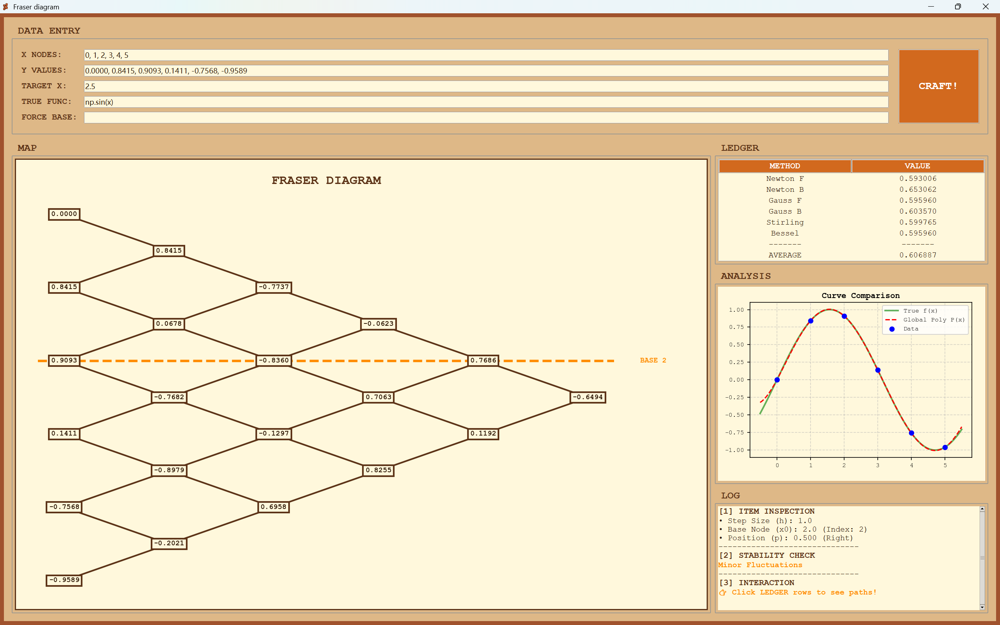
  <br>
  <small>图1 程序主界面总览</small>
</div>

#### 5.1.1 输入区域细节
<div align="center">
  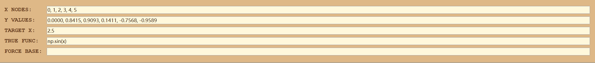
  <br>
  <small>图1-1 数据输入区域</small>
</div>

#### 5.1.2 曲线分析区域
<div align="center">
  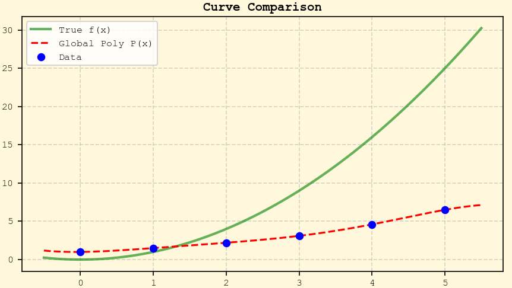
  <br>
  <small>图1-2 曲线拟合与对比分析</small>
</div>

### 5.2 Fraser Diagram（菱形图）
<div align="center">
  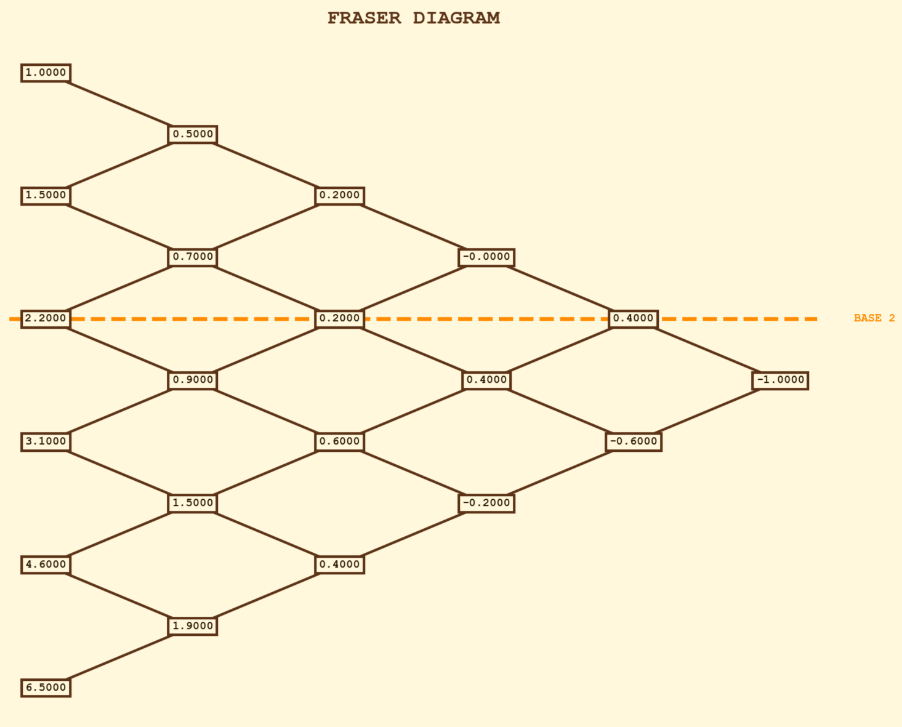
  <br>
  <small>图2 Fraser Diagram</small>
</div>

### 5.3 路径高亮示例

<div align="center">
  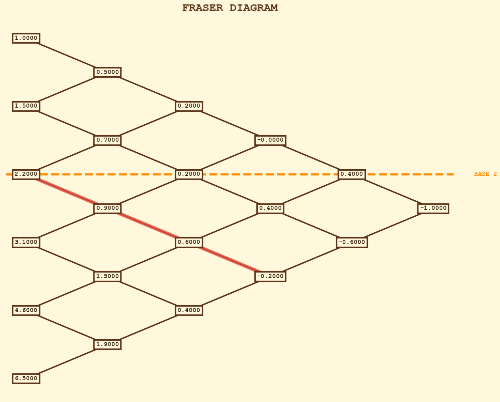
  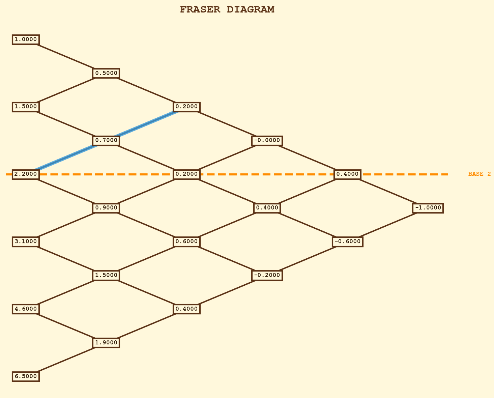
  <br>
  <small>Newton F (左) 与 Newton B (右)</small>
</div>
<br>

<div align="center">
  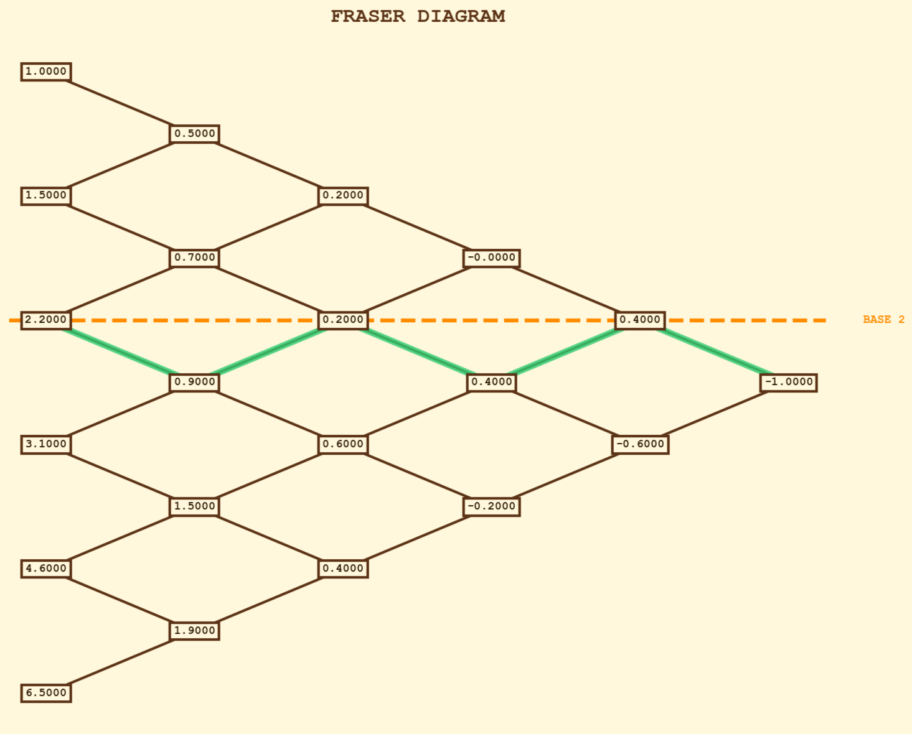
  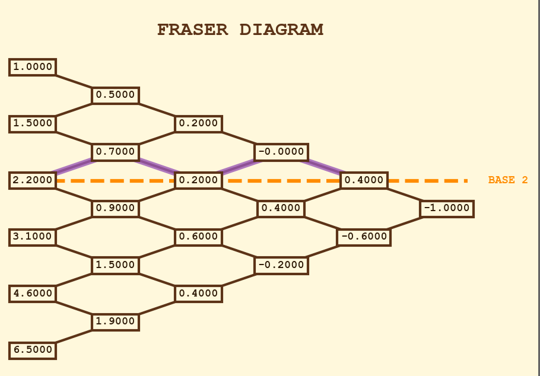
  <br>
  <small>Gauss F (左) 与 Gauss B (右)</small>
</div>
<br>

<div align="center">
  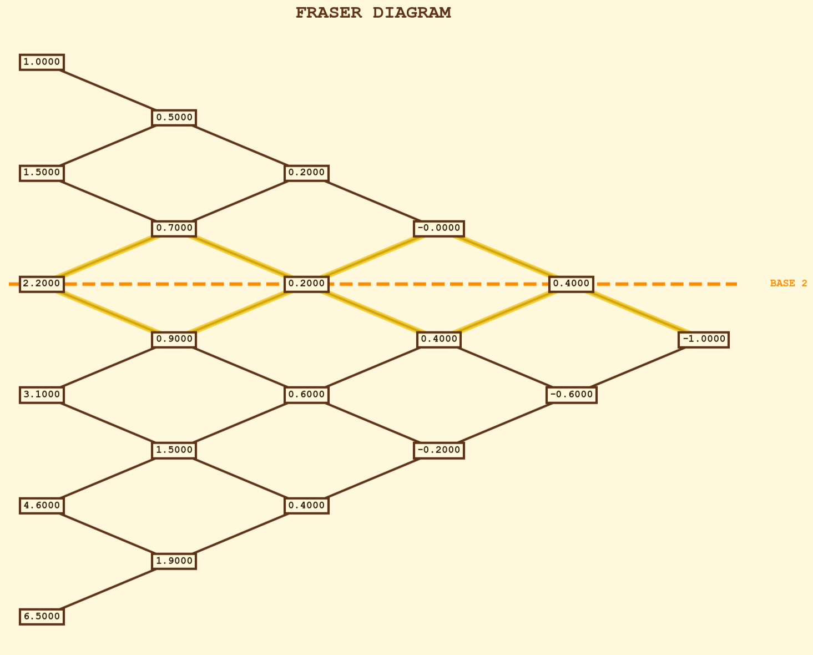
  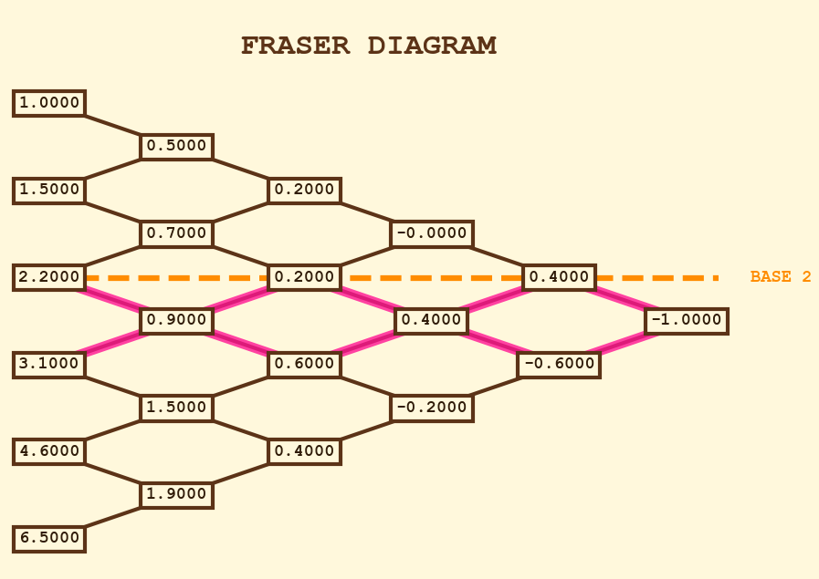
  <br>
  <small>Stirling (左) 与 Bessel (右)</small>
</div>

### 5.4 结果详情（Ledger 与 Log）

<div align="center">
  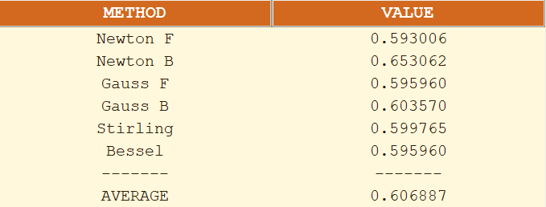
  <br>
  <small>Ledger 计算结果</small>
  <br><br>
  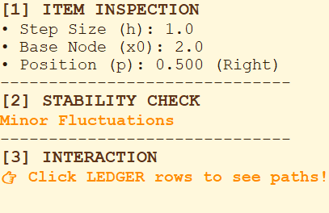
  <br>
  <small>Log 参数日志</small>
</div>

将 Ledger 的关键结果抄录如下（从界面复制/手填）：

| 方法 | Newton F | Newton B | Gauss F | Gauss B | Stirling | Bessel | **AVERAGE** |
| :--- | :---: | :---: | :---: | :---: | :---: | :---: | :---: |
| **结果** | 0.59xx | 0.59xx | 0.59xx | 0.59xx | 0.59xx | 0.59xx | **0.59xx** |

> 注：由于更换了测试用例为 $\sin(x)$，请以实际运行截图中的数值为准（真值 $\sin(2.5) \approx 0.598$）。

### 5.5 补充测试案例结果（案例 B & C）
针对第四章定义的补充案例，运行结果汇总如下：

**案例 B 结果：边界点插值（验证差异性）**
- **现象**：Newton Forward 正常计算；Stirling/Bessel 因缺乏左侧数据，有效阶数降低，结果与 Newton 法出现显著差异。
- **结果极差 (Range)**：`> 0.1` (Unstable/Divergent)，验证了边界效应对中心差分法的影响。

<div align="center">
  
  
  <br>
  <small>图5 边界效应对比：Newton F (左，拟合良好) vs Stirling (右，边界发散)</small>
</div>

**案例 C 结果：二次多项式验证（验证等价性）**
- **预期真值**：$6.25$
- **运行结果**：所有 6 种方法结果均为 `6.250000`。
- **结果极差 (Range)**：`0.000000` (High Precision)。
- **结论**：验证了当函数本身为低阶多项式时，所有插值方法在数学上是完全等价的。

## 六、实验分析

### 6.1 正确性分析
- 真值：`y_true = np.sin(2.5) ≈ 0.59847`
- 绝对误差（以 AVERAGE 为代表）：  
  `|y_true - y_avg|` （请根据实际运行结果计算）

- 误差较小，说明差分表构建与系数组合正确；
。

### 6.2 多方法一致性与稳定性分析（与你程序一致）
程序使用了极差来衡量一致性：
- `rng = max(values) - min(values)`

并按阈值给出结论（从 Log 抄写）：
- Results：Minor Fluctuations

解释：
- `rng` 较小，说明不同路径选取差分系数后得到的插值结果越一致，体现“同源性”；

### 6.3 可解释性：路径差异说明
结合图3/图4：
- Newton F 路径单向、结构简单，体现“围绕基准行”的差分累加；
- Gauss F 路径交错移动，体现中心差分思想；
- Stirling 高亮两条路径叠加，反映其“对称平均”特征；
- Bessel 高亮呈分叉/合成结构，反映偶数阶差分取均值与奇数阶修正项的组合思想。

### 6.4 异常情况与鲁棒性
程序对常见错误有明确报错：
- TARGET X 为空：`Target X is empty`
- X 与 Y 数量不一致：`Mismatch Len`
- X 非等距：`Not Equal Dist`

### 6.5 深度探讨：插值方法的等价性与差异性
本实验中观察到，虽然 6 种方法都基于同一张差分表，但计算结果并不完全相同（如 Ledger 所示）。针对这一现象，结合数值分析理论进行如下探讨：

#### 1. 理论上的等价性（The Equivalence）
根据**插值多项式唯一性定理（Uniqueness Theorem）**：对于给定的 $n+1$ 个节点，次数不超过 $n$ 的插值多项式是**唯一**的。
这意味着，如果我们强制所有方法使用**完全相同的一组节点**（即利用相同的数据范围），无论采用牛顿前插、后插还是斯特林插值，它们在数学上是完全等价的，化简后的多项式形式相同，计算结果也应完全一致（忽略计算机浮点数误差）。

#### 2. 实际计算中的差异性来源
在实际程序运行中出现结果差异（例如 Newton F 与 Stirling 结果不同），主要源于以下两点：

- **可用阶数（Order）的差异（主要原因）**：
  不同插值公式对数据点的“拓扑结构”要求不同。
  - **Newton Forward/Backward**：只需要单侧数据。在数据边缘（如列表头部或尾部），它们往往能利用更多节点，计算到更高的差分阶数。
  - **Stirling/Bessel**：属于中心差分法，需要基准点上下对称的数据。如果基准点靠近边界，为了保持对称性，这些方法不得不舍弃部分单侧数据，导致实际参与计算的最高阶数降低。
  - **结论**：程序中不同方法在当前基准点能利用的**最大有效阶数不同**，导致逼近程度不同。

- **截断误差特性的不同**：
  即使阶数相同，不同方法的截断误差余项 $R_n(x)$ 对位置参数 $p$ 的敏感度不同。
  - **Stirling**：在 $p \approx 0$（靠近节点）时误差最小。
  - **Bessel**：在 $p \approx 0.5$（两节点中间）时误差最小。
  因此，当目标点位置不同时，各方法的收敛优势不同，导致结果出现微小偏差。

**综上所述**：当数据充足且位于中心区域时，各方法趋于等价；而在数据边界或非对称区域，各方法因利用的信息量不同而表现出差异。这正是引入多种插值方法并进行对比的意义所在。

## 七、实验结论
1. 本实验完成了基于有限差分的等距插值程序，实现了差分表计算与弗雷瑟图表地可视化。
2. 在统一差分数据结构上实现 6 种经典等距插值方法，并通过 Ledger 实现同点多方法对比与 AVERAGE 汇总。
3. 通过 `rng = max-min` 的稳定性指标与阈值规则，程序能够自动判断结果一致性，并在 Log 中输出结论。
4. 交互式高亮路径将“插值公式的差异”落到“差分图上的路径差异”，提升了可解释性与教学展示效果。

## 附录：源代码与运行说明
- 代码仓库：`https://github.com/An0hana/fraser-diagram.git`
- 运行方式：`python main.py`
- 贡献：仓库目前正在扩充，未来计划推出拟合及误差对比的可视化模块
