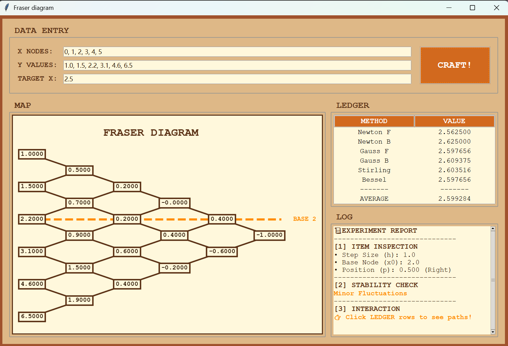
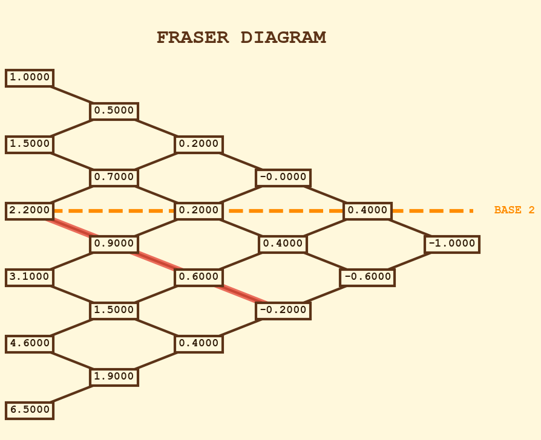
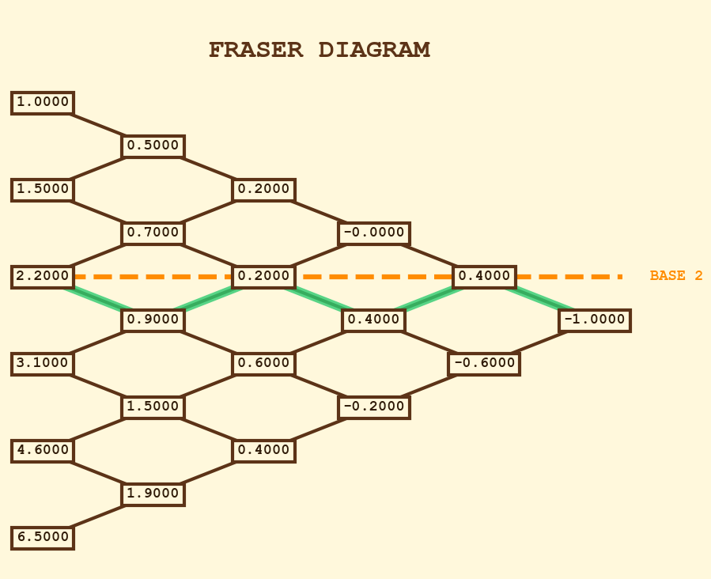
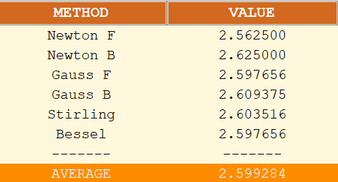
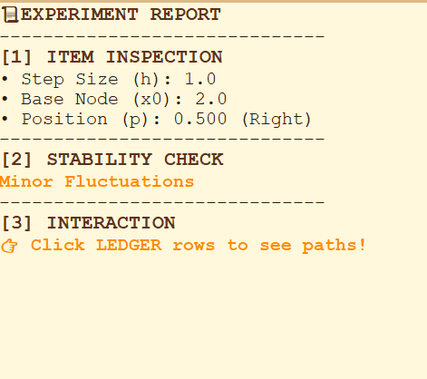

# 上机实验报告：基于弗雷瑟图的等距插值程序实现

## 一、实验目标
1. 通过编程实现“等距节点有限差分插值”的完整流程：输入节点数据 → 构建差分表 → 计算插值结果。
2. 使用 **弗雷瑟图（Fraser Diagram）** 将差分表可视化，使差分结构更直观。
3. 在统一框架下实现并对比 6 种经典等距插值方法（牛顿前/后插、高斯前/后向、斯特林插值、贝塞尔插值），并给出稳定性分析。
4. 提供交互式可解释性：点击不同方法即可在图上高亮对应“取差分系数的路径”。

---

## 二、实验内容
本实验实现的功能包括：
1. **输入解析与校验**
   - 从 GUI 输入框读取 `X NODES`、`Y VALUES`、`TARGET X`；
   - 支持中英文逗号输入；
   - 检查 X 与 Y 数量一致（不一致报错 `Mismatch Len`）；
   - 检查 X 是否等距（非等距报错 `Not Equal Dist`）。
2. **差分表构建**
   - 构建 `diff_table[i][j]`，其中 `j` 为差分阶数、`i` 为行号；
   - 递推：`diff_table[i][j] = diff_table[i+1][j-1] - diff_table[i][j-1]`；
   - 时间复杂度约为 `O(n^2)`。
3. **弗雷瑟图绘制**
   - 将差分表按菱形拓扑绘制，每个节点显示对应差分值；
   - 用连线表示差分递推关系；
   - 自动标出本次插值的“基准节点” `BASE k`。
4. **六种插值结果计算与对比**
   - Newton F、Newton B、Gauss F、Gauss B、Stirling、Bessel；
   - 输出到 Ledger；并额外输出 `AVERAGE`（6 种方法的均值）。
5. **稳定性检查**
   - 取 6 方法结果的极差 `rng = max(values) - min(values)`；
   - 稳定性判断依据：
     - `rng < 1e-5`：High Precision
     - `rng < 0.1`：Minor Fluctuations
     - 否则：Unstable Results
6. **交互式路径高亮**
   - 点击 Ledger 对应方法行，在弗雷瑟图表上高亮路径：
     - Stirling：叠加两条 Gauss 路径
     - Bessel：出现“分叉/均值”式连接

---

## 三、实现过程

### 3.1 程序整体流程
1. 启动程序：`python main.py`，创建 Tk 主窗口并实例化 `InterpolationApp`。
2. 输入 `X NODES / Y VALUES / TARGET X`，点击 `CRAFT!`。
3. `process_data()` 执行：
   1) 清空旧图与旧表格、清空日志；  
   2) 调用 `calculator.load_data()` 完成解析与等距检查；  
   3) 构建差分表 `_build_diff_table()`；  
   4) 调用 `plotter.plot_diagram()` 绘制 Fraser 图，并标注 `BASE k`；  
   5) 调用 `calculate_all()` 得到 6 方法结果；写入 Ledger；计算 AVERAGE；  
   6) 在 Log 输出：步长 `h`、基准节点 `x0`、位置参数 `p`、稳定性判据与交互提示；  
4. 用户点击 Ledger 某一行触发 `on_tree_select()`，调用 `plotter.highlight_path()` 高亮对应路径。

### 3.2 等距检查与关键参数
- 等距检查：令 `diff = np.diff(X)`，若 `not np.allclose(diff, diff[0])` 则报错 `Not Equal Dist`。  
- 步长：`h = diff[0]`  
- 基准节点选择（你的实现）：  
  `base_k = argmin |X - target_x|`（选择离目标点最近的节点）
- 位置参数：  
  `p = (target_x - X[base_k]) / h`  
  并在 Log 中输出位置描述 Center/Left/Right。

### 3.3 差分表递推（核心共享模块）
初始化：
- `diff_table[:,0] = Y`

递推：
- 对 `j=1..n-1`：
  - 对 `i=0..n-1-j`：
    - `diff_table[i][j] = diff_table[i+1][j-1] - diff_table[i][j-1]`

差分表是 6 种方法的共同基础，不同插值公式只是在差分结构中选取系数的方式不同。因此差分表将 6 种插值方法优美地统一在同一框架之内

### 3.4 Fraser 图坐标映射
绘制时采用如下映射（与你 plotter 一致）：
- 列坐标：`x = j`
- 行坐标：`y = -(i + j/2)`
这样每一阶差分相对前一阶会在纵向“错半格”，视觉上形成菱形层级结构。

### 3.5 路径高亮规则
- Newton F：在同一行逐列向右（固定 row=k）
- Newton B：每前进一阶，row 向上移动（row=k-j）
- Gauss F / Gauss B：按奇偶阶交错移动 row
- Stirling：叠加 Gauss F 与 Gauss B 两条路径
- Bessel：奇数阶显示“从两点合成一点”的分叉连线；偶数阶显示由中间点向上下两点扩散（反映均值结构）

---

## 四、输入
> 说明：由于程序强制要求 X 等距，本实验选择等距数据。

- X NODES：`0, 1, 2, 3, 4, 5`
- Y VALUES：`1.0, 1.5, 2.2, 3.1, 4.6, 6.5`
- TARGET X：`2.5`

---

## 五、输出（程序运行结果）

### 5.1 界面总览

### 5.2 Fraser Diagram（菱形图）

### 5.3 路径高亮示例
Newton F 路径：

Newton B 路径：

Gauss F 路径：

Gauss B 路径：

Stirling 路径：

Bessel 路径：

### 5.4 Ledger（6 方法结果 + 平均值）

将 Ledger 的关键结果抄录如下（从界面复制/手填）：

| 方法 | 插值结果 |
|---|---:|
| Newton F | 2.562500 |
| Newton B | 2.625000 |
| Gauss F | 2.597656 |
| Gauss B | 2.609375 |
| Stirling | 2.603516 |
| Bessel | 2.597656 |
| **AVERAGE** | 2.599284
### 5.5 Log（关键参数与稳定性判定）

---

## 六、实验分析

### 6.1 正确性分析
- 真值：`y_true = f(target_x) = 2.5`
- 绝对误差（以 AVERAGE 为代表）：  
  `|y_true - y_avg| = |2.5 - 2.599284| = 0.099284`

- 误差接近 0，说明差分表构建与系数组合正确；
。

### 6.2 多方法一致性与稳定性分析（与你程序一致）
程序使用了极差来衡量一致性：
- `rng = max(values) - min(values)`

并按阈值给出结论（从 Log 抄写）：
- Results：Minor Fluctuations

解释：
- `rng` 较小，说明不同路径选取差分系数后得到的插值结果越一致，体现“同源性”；

### 6.3 可解释性：路径差异说明
结合图3/图4：
- Newton F 路径单向、结构简单，体现“围绕基准行”的差分累加；
- Gauss F 路径交错移动，体现中心差分思想；
- Stirling 高亮两条路径叠加，反映其“对称平均”特征；
- Bessel 高亮呈分叉/合成结构，反映偶数阶差分取均值与奇数阶修正项的组合思想。

### 6.4 异常情况与鲁棒性
程序对常见错误有明确报错：
- TARGET X 为空：`Target X is empty`
- X 与 Y 数量不一致：`Mismatch Len`
- X 非等距：`Not Equal Dist`

---

## 七、实验结论
1. 本实验完成了基于有限差分的等距插值程序，实现了差分表计算与弗雷瑟图表地可视化。
2. 在统一差分数据结构上实现 6 种经典等距插值方法，并通过 Ledger 实现同点多方法对比与 AVERAGE 汇总。
3. 通过 `rng = max-min` 的稳定性指标与阈值规则，程序能够自动判断结果一致性，并在 Log 中输出结论。
4. 交互式高亮路径将“插值公式的差异”落到“差分图上的路径差异”，提升了可解释性与教学展示效果。

---

## 附录：源代码与运行说明
- 代码仓库：`https://github.com/An0hana/fraser-diagram.git`
- 运行方式：`python main.py`
- 贡献：仓库目前正在扩充，未来计划推出拟合及误差对比的可视化模块
